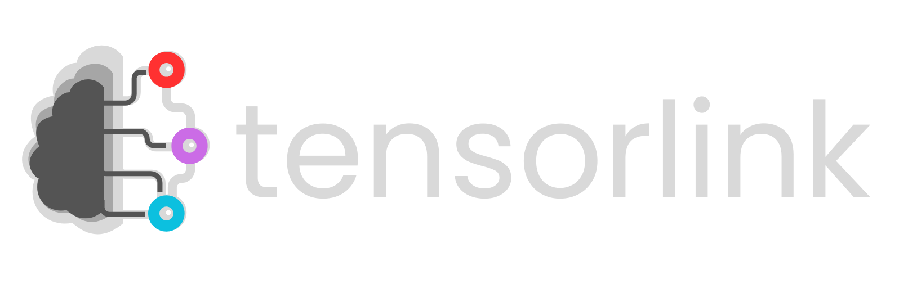

<p align="center">
  
</p>

<h3 align="center" style="margin-top: -32px">Distributed AI Inference & Training for Everyone</h3>
<p align="center">
  <i>Plug-and-play models and APIs for distributed neural network inference and training with PyTorch and Hugging Face.</i>
</p>

<p align="center">
  
  
  
  
  
  <a href="https://discord.gg/aCW2kTNzJ2">
    
  </a>
  <a href="https://smartnodes.ca/localhostGPT" target="_blank">
    
  </a>
</p>


> ⚠️ **Pre-release Notice:** This is an early version of the project. Some features may be incomplete or unstable. **Not 
> recommended for production use at this time.**

**Tensorlink** is a Python library and computational platform that provides powerful tools and APIs for large-scale 
neural network training and inference in PyTorch. It enables users to work with complex models that exceed the memory 
limits of a single device, expanding access to cutting-edge deep learning. Tensorlink streamlines the parsing and 
distribution of models and provides a framework for accessing and sharing computation directly peer-to-peer, making 
powerful models available on demand and enabling users to easily donate or tap into idle compute.

## Table of Contents
1. [Introduction](#introduction)
   - [Why](#Why)
   - [Key Features](#key-features)
   - [Current Limitations](#current-limitations)
2. [Getting Started](#getting-started)
   - [Installation](#installation)
3. [Training & Inference with Tensorlink](#training--inference-with-tensorlink)
   - [Distributed Models](#distributed-pytorch-models)
   - [Inference APIs](#inference-apis)
4. [Nodes & Communication](#nodes--communication)
   - [Private Network Example](#example-private-network-of-nodes)
5. [Running a Node (Mining)](#running-a-node-mining)
6. [Roadmap](#roadmap)
7. [Contributing](#contributing)

> 🖥️ **Interested in Powering the Network?** Learn how in the [Running a Node](#running-a-node-mining) section to set up your own node and join the network.

## Introduction

Tensorlink is a flexible and powerful framework designed to facilitate neural network offloading and acceleration within 
PyTorch, a leading machine learning framework in Python. It simplifies the parsing and distribution of models, supporting
pre-trained architectures from libraries like Hugging Face, enabling seamless execution across distributed consumer 
hardware. By leveraging techniques such as model sharding, parallel workflow execution, automated peer discovery, and a 
built-in incentive system, Tensorlink provides an efficient, decentralized alternative to traditional cloud-based ML 
services. This significantly lowers the barrier to entry for both training and inference, empowering individuals and 
organizations to deploy state-of-the-art AI models without the need for costly, centralized infrastructure.

### Why

State-of-the-art models are incredibly powerful, but also large, often too big to run on a single device. Hosting them 
across multiple machines requires costly GPU infrastructure and complex workflows for device communication and 
synchronization. This makes participation difficult for individual developers and small teams.

Furthermore, existing cloud solutions store sensitive data on external servers, increasing the risk of data breaches 
and unauthorized data harvesting. All 'free' commercial LLM services log and analyze user inputs, undermining user 
privacy. On top of all that, these centralized data centres place a growing strain on power grids.

Tensorlink provides a decentralized, privacy-first, and sustainable alternative, distributing workloads across consumer 
hardware directly peer-to-peer, making advanced model inference and training accessible, secure, and grid-friendly.

### Key Features

Tensorlink integrates directly into PyTorch codebases through lightweight wrappers around core PyTorch objects such as 
`Module` and `Optimizer`. This allows developers to maintain familiar workflows while scaling models dynamically across 
a distributed compute network. By enabling collaboration and resource-sharing between users, Tensorlink brings the power
of distributed training and inference to a broader community.

### `DistributedModel`
A wrapper around `torch.nn.Module` objects designed to simplify the process of running models across multiple devices
or nodes. It automatically parses and distributes model submodules across worker nodes, making efficient use of 
available compute. Crucially, it preserves the standard PyTorch interface, including `forward`, 
`backward`, and `parameters`, allowing developers to integrate it into existing codebases with minimal friction. 
Tensorlink supports both model parallelism and data parallelism, and handles synchronization and communication between
distributed components behind the scenes, streamlining complex workflows.

### `DistributedOptimizer`
The `DistributedOptimizer` is built to complement `DistributedModel`, providing synchronized parameter updates across 
distributed training nodes. It is fully compatible with PyTorch’s built-in optimizers as well as third-party optimizers 
used in Hugging Face transformers. This ensures seamless integration into diverse training pipelines and guarantees 
consistent updates in sharded or parallelized model training environments, improving training stability and 
reproducibility in distributed contexts.

### On-Demand Inference APIs
Tensorlink includes an API for on-demand inference using open-source Hugging Face pre-trained models. These APIs 
allow users to instantly access popular models in their applications.

### Public & Private Compute Networks
By default, all Tensorlink nodes are connected through a smart contract-secured peer-to-peer mesh. This decentralized 
architecture enables users to share their idle computational resources and earn token-based rewards in return. The 
network supports both free and paid usage of resources, giving users flexible options depending on their compute needs and 
budget.


### Current Limitations
As Tensorlink is still in its early release phase, users may encounter bugs, performance inconsistencies, and limited
network availability. As the network matures, these limitations are expected to be progressively addressed.
- Model support is currently focused on open-source Hugging Face models that do not require API 
keys. Safe and secure methods for custom model distribution are under active development and will be available in future 
updates. 
- In this early stage, there are also some practical constraints related to model size and resource allocation. Due to 
limited availability of public workers, tasks involving models larger than approximately 10 billion parameters may not 
perform optimally. 
- Additionally, public inference and training jobs are currently restricted to a single worker, with 
data parallelism temporarily disabled for these tasks. However, data parallel acceleration remains available for local 
jobs and within private clusters (experimental). 
- Internet latency and connection quality can significantly affect performance for public tasks over P2P, while API 
calls are relatively unaffected. *Fibre internet and over ethernet is recommended for the best performance.*
  - may pose challenges for latency-sensitive or high-throughput training and inference scenarios in Python.  

## Getting Started

Whether you're here to run distributed models or contribute resources, this section will help you get started quickly:

- To run a distributed model using Python, continue through this section.  
- To mine and contribute resources to the network, check out **[Running a Node](#running-a-node-mining)**.  
- To use Tensorlink for inference via API calls, go to the **[API](#inference-apis)** section.

### Installation

Before installing Tensorlink, ensure you meet the following requirements:

- UNIX/MacOS (Windows support coming soon...)
- Python 3.10+
- PyTorch 2.3+ (ensure model compatibility with torch version)

While version constraints will be relaxed in future releases, Python 3.10+ and a UNIX-based OS are currently required for stable usage.

To install Tensorlink, simply use pip:

```bash
pip install tensorlink
```

This command will install Tensorlink and all its dependencies. If you're working in a virtual environment (recommended), make sure it's activated before installing.

*⚠️ Tensorlink is designed to be compatible with all PyTorch-based models and optimizers. However, some issues can be
expected to occur during the pre-alpha phase.*

## Training & Inference with Tensorlink

### Distributed PyTorch Models

A `DistributedModel` is a wrapper that automatically connects your machine to the Tensorlink network and offloads your
model to available Workers. It behaves like a standard PyTorch model and supports three ways to define the model:

- A Hugging Face model name (e.g. `"microsoft/microsoft-Phi-4B-Instruct"`)
- A custom `torch.nn.Module` object
- A local file path to saved model parameters (`.pt` or `.bin`)

You can also use the distributed model to spawn an optimizer using `DistributedModel.create_optimizer`, which handles remote synchronization automatically.

```python
from tensorlink import DistributedModel
from torch.optim import AdamW
from my_custom_model import CustomModel  # Optional: Your custom model
import torch

# Option 1: Hugging Face model (Stable)
distributed_model = DistributedModel(
    model="Qwen/Qwen2.5-7B-Instruct",  # Model name (str), nn.Module, or path to weights
    training=False,                    # Set to True only if training; default is inference
    optimizer_type=None,               # Required if training; ignored in inference
    scheduler_type=None,               # Optional: pass a PyTorch scheduler class
    device="cuda",                     # "cuda", "cpu", or None (auto-detect)
    dtype=torch.float16,               # torch.float32 (default), float16, or bfloat16
    trusted=False,                     # Set True only for local/trusted jobs
    verbose=True                       # Enables debug output
)

# Option 2: Custom PyTorch model (⚠️ Experimental — Under development, may not work as expected)
distributed_model = DistributedModel(
    model=CustomModel(),
    training=True,
    optimizer_type=AdamW
)

# Option 3: Load from local parameters file (⚠️ Experimental — Under development, support is incomplete)
# distributed_model = DistributedModel(
#     model="path/to/model_weights.pt",  # or .bin
#     training=False,
#     optimizer_type=AdamW
# )

# Create optimizer (only needed for training)
distributed_model.create_optimizer(lr=5e-5)

```

Training progress and network activity will soon be viewable through the [Smartnodes](https://smartnodes.ca/app) dashboard (currently under development).

## Inference APIs

Tensorlink provides a lightweight API for distributed inference, offering on-demand access to popular pre-trained models from Hugging Face. 
It supports both free public inference on a rotating set of models and paid requests for dedicated jobs and custom services.
A good example of this in action is [**localhostGPT**](https://smartnodes.ca/tensorlink/localhostGPT), a simple project that runs an LLM chatbot using Tensorlink.
Below is the most recent set of free, publicly accessible models:

- `Qwen/Qwen2.5-7B-Instruct`

> ⚠️ A wider selection of much larger models will become available as more nodes join the network. We appreciate your patience, please check back soon for updates.

#### Example: API request from Python (with `requests`)

```python
import requests

https_serv = "https://smartnodes-lab.ddns.net/tensorlink-api"  # May not work with all clients 
http_serv = "http://smartnodes-lab.ddns.net/tensorlink-api"  # Use this if HTTPS fails

payload = {
    "hf_name": "Qwen/Qwen2.5-7B-Instruct",
    "message": "Describe the role of AI in medicine.",
    "max_length": 1024,
    "max_new_tokens": 256,
    "temperature": 0.7,
    "do_sample": True,
    "num_beams": 4,
    "history": [
        {"role": "user", "content": "What is artificial intelligence?"},
        {"role": "assistant", "content": "Artificial intelligence refers to..."}
    ]
}

response = requests.post(f"{https_serv}/generate", json=payload)
print(response.json())
```


#### Example: API request with JavaScript (Fetch API)

```js
// Available endpoints (status may vary):
const https_serv = "https://smartnodes-lab.ddns.net/tensorlink-api";  // May not work with all clients
const http_serv = "http://smartnodes-lab.ddns.net:443/tensorlink-api"; // Use this if HTTPS fails

const response = await fetch(http_serv + '/generate', {
  method: 'POST',
  headers: {
    'Content-Type': 'application/json',
  },
  body: JSON.stringify({
    hf_name: modelParams.model,
    message: userMessage.content,
    max_length: modelParams.maxLength,
    max_new_tokens: modelParams.maxNewTokens,
    temperature: modelParams.temperature,
    do_sample: modelParams.doSample,
    num_beams: modelParams.numBeams,
    history: messages.map(msg => ({ 
      role: msg.role, 
      content: msg.content 
    })),
  }),
});

const result = await response.json();
console.log(result);

```

### 📥 API Parameters

| Field            | Type    | Required | Description                                            |
|------------------|---------|----------|--------------------------------------------------------|
| `hf_name`        | string  | ✓        | Name of the Hugging Face model                         |
| `message`        | string  | ✓        | The user's input prompt or question                    |
| `max_length`     | int     | ✕        | Total token limit (input + output)                     |
| `max_new_tokens` | int     | ✕        | Maximum number of tokens to generate                   |
| `temperature`    | float   | ✕        | Sampling temperature (e.g., `0.7` = more creative)     |
| `do_sample`      | boolean | ✕        | Whether to sample (`True`) or use greedy decoding      |
| `num_beams`      | int     | ✕        | Beam search width (`1` for greedy, `>1` for diversity) |
| `history`        | array   | ✕        | Conversation history (`[{ role, content }]`)           |


### ⚠️ Note
- Currently limited to select HF models (listed in `tensorlink/ml/models.json`)
  - Custom models and more diverse selection coming soon...
- Keep histories concise for faster response time.
- Model loading and generation performance depends on network conditions and node availability.

## Nodes & Communication

Tensorlink enables secure, distributed computing across local, private, and public networks. Each node, whether a 
**User**, **Worker**, or **Validator**, plays a role in powering collaborative machine learning workflows.

By running a Tensorlink node, you can contribute compute resources, launch distributed models, or coordinate jobs. 
Whether you're experimenting locally or contributing to the public network, getting started is simple.

### Example: Private Network of Nodes

The following example demonstrates how nodes could interact for fully closed job on a group of devices 
(all simulated in the same script for this example):

```python
from tensorlink import UserNode, ValidatorNode, WorkerNode, DistributedModel
import torch, logging, time
from transformers import AutoTokenizer

# Local setup parameters
LOCAL = True          # Force localhost-only connections (127.0.0.1)
UPNP = not LOCAL      # Disable UPnP to prevent external exposure
OFFCHAIN = LOCAL      # Use off-chain job coordination (fully private)

model_name = 'TinyLlama/TinyLlama-1.1B-Chat-v1.0'

# Run on Device 1
user = UserNode(upnp=UPNP, off_chain_test=OFFCHAIN, local_test=LOCAL, print_level=logging.DEBUG)

# Run on Device 1 (will remove the need for also spawning a validator soon!)
validator = ValidatorNode(upnp=UPNP, off_chain_test=OFFCHAIN, local_test=LOCAL, print_level=logging.DEBUG)

# Run on Device 2+
worker = WorkerNode(upnp=UPNP, off_chain_test=OFFCHAIN, local_test=LOCAL, print_level=logging.DEBUG)

# Connect worker and user to validator manually
val_key, val_host, val_port = validator.send_request("info", None)  # Get device information

# Connected to main device for each other device
worker.connect_node(val_host, val_port, node_id=val_key)
user.connect_node(val_host, val_port, node_id=val_key)

# Request a distributed inference model
distributed_model = DistributedModel(model_name, training=False, node=user)
tokenizer = AutoTokenizer.from_pretrained(model_name)

# Perform local inference loop on the user's device
for _ in range(5):
    input_text = "You: Hello Bot."
    inputs = tokenizer(input_text, return_tensors="pt", padding=True, truncation=True)
    with torch.no_grad():
        outputs = distributed_model.generate(
            inputs,
            max_new_tokens=256,
            temperature=0.7,
            eos_token_id=tokenizer.eos_token_id,
            do_sample=True
        )
    print("Bot:", tokenizer.decode(outputs[0], skip_special_tokens=True))

# Shutdown
user.cleanup()
worker.cleanup()
validator.cleanup()
```

#### Notes:
- All nodes are simulated on the same machine or LAN group.
- Customize `connect_node()` with local IPs to run across multiple physical devices on a WAN/LAN.


### Running a Node (Mining)

Contributing compute to Tensorlink is as simple as running a node. Whether you're a hobbyist with a spare GPU or managing a cluster of machines, your hardware can help power real-world machine learning workflows across the network. By mining with Tensorlink, you join a decentralized ecosystem that rewards contributors for supporting distributed inference and training jobs, no special setup required.


### Getting Started

1. **Download the Node Binary**  
   - Get the latest `tensorlink-miner` from the [**Releases**](https://github.com/smartnodes-lab/tensorlink/releases) page.
   - Make sure your system has:
     - Python 3.10+
     - A **CUDA-capable GPU** (Support for other hardware and backends coming soon.)

2. **Configure Your Node**  
   - Open the `config.json` file and set:
     - `"wallet"`: Your Ethereum (Base) wallet address (used to receive rewards).
     - `"mining"`: Set to `true` if you'd like the node to run a script while idle (e.g., a GPU-mining script).
     - `"mining_script"`: _(Optional, currently non-functional)_ Path to the script to run during idle time.  
       ⚠️ **Note:** Mining support is a work in progress and is not yet implemented.

3. **Run the Worker**  
   - Launch your node using the provided script:
     ```bash
     ./run-worker.sh
     ```
   - You should see logs indicating a successful network connection and readiness to receive jobs.

## Roadmap

Here’s what’s in the works for Tensorlink:

- **Multi-GPU / Large Model Support (Work in Progress)**: Support for training models larger than a single GPU is already implemented. Deployment depends on growing the active node count to enable stable distributed execution.

- **Custom Model Integration (Work in Progress)**: Users will be able to plug in and train their own PyTorch models using the Tensorlink infrastructure.

- **Smartnodes Verification Layer (Testnet)**: On-chain proposal validation for enhanced security and decentralization. Includes early support for stablecoin and native reward flows to workers and validators.

- **Idle Script Execution / Mining Support (Work in Progress)**: Nodes will be able to run a specified script while idle, such as GPU mining or other workloads. Configuration exists but the feature is not yet functional.

- **Scalable Validator Set (Work in Progress)**: Improvements to the validator set are underway to handle higher volumes of job proposals and accommodate a broader range of HTTPS endpoints and server types used in real-world machine learning pipelines.

- **Web Dashboard (Testnet)**: Monitor job activity, system health, and earnings from a local or hosted interface.

## Contributing

Contributions to help build and improve Tensorlink are always welcome! Here's how you can get involved:

- **Report Issues:** If you encounter a bug or have a feature suggestion, please create an issue on our [GitHub repository](https://github.com/smartnodes-lab/tensorlink).
- **Submit Pull Requests:** Fork the repository, implement improvements or fixes, and submit a pull request.
- **Join the Community:** Connect with us and other contributors on our [Discord server](https://discord.gg/aCW2kTNzJ2) to share ideas, ask questions, or collaborate.

Your contributions, whether through code, feedback, or documentation, are essential in making Tensorlink the best tool 
for decentralized neural network training. We appreciate your help!

### Donate

If you would like to support our work, consider buying us a coffee! Your contributions help us continue developing and improving Tensorlink.

<a href="https://www.buymeacoffee.com/smartnodes" target="_blank">
    
</a>
