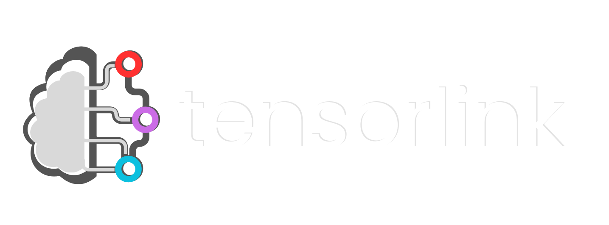

<div align="center" style="background-color: #212121; border-radius: 12px; padding: 20px;">
    <p align="center">
      
    </p>
    <h3 align="center" style="margin-top: -32px">Distributed AI Inference & Training for Everyone</h3>
    <p align="center">
      <i>Plug-and-play models and APIs for distributed neural network inference and training with PyTorch.</i>
    </p>
    <p align="center">
      
      
      
    </p>
</div>

**Tensorlink** is a Python library and computational platform that provides powerful tools and APIs for large-scale 
neural network training and inference in PyTorch. It enables users to work with complex models that exceed the memory 
limits of a single device, expanding access to cutting-edge deep learning. Tensorlink streamlines the parsing and 
distribution of models, and provides a framework for accessing and sharing computation directly peer-to-peer, making 
powerful models available on demand.

## Table of Contents
1. [Introduction & Key Features](#introduction)
2. [Training & Inference with PyTorch](#training-and-inference-with-pytorch)
3. [Inference APIs](#inference-apis)
4. [Running a Node](#running-a-node)
5. [Utilizing Local & Private Devices]()
6. [Contribute](#contributing)

> 💡 **Looking to get started?** Jump to [Training & Inference with PyTorch](#training-and-inference-with-pytorch) for a hands-on guide to running your first distributed model with Tensorlink.
>
> 🖥️ **Interested in Powering the Network?** Learn how in the [Running a Node](#running-a-node) section to set up your own node and join the network.

## Introduction

Tensorlink is a flexible and powerful framework designed to facilitate neural network offloading and acceleration within 
PyTorch, a leading machine learning framework in Python. It simplifies the parsing and distribution of models, supporting
pre-trained architectures from libraries like Hugging Face, enabling seamless execution across distributed consumer 
hardware. By leveraging techniques such as model sharding, parallel workflow execution, automated peer discovery, and a 
built-in incentive system, Tensorlink provides an efficient, decentralized alternative to traditional cloud-based ML 
services. This significantly lowers the barrier to entry for both training and inference, empowering individuals and 
organizations to deploy state-of-the-art AI models without the need for costly, centralized infrastructure.

### Key Features

Tensorlink integrates directly into PyTorch codebases through lightweight wrappers around core PyTorch objects such as 
`Module` and `Optimizer`. This allows developers to maintain familiar workflows while scaling models dynamically across 
a distributed compute network. By enabling collaboration and resource-sharing between users, Tensorlink brings the power
of distributed training and inference to a broader community.

### `DistributedModel`
A wrapper around `torch.nn.Module` objects designed to simplify the process of running models across multiple devices
or nodes. It automatically parses and distributes model submodules across worker nodes, making efficient use of 
available compute. Crucially, it preserves the standard PyTorch interface, including `forward`, 
`backward`, and `parameters` — allowing developers to integrate it into existing codebases with minimal friction. 
Tensorlink supports both model parallelism and data parallelism, and handles synchronization and communication between
distributed components behind the scenes, streamlining complex workflows.

### `DistributedOptimizer`
The `DistributedOptimizer` is built to complement `DistributedModel`, providing synchronized parameter updates across 
distributed training nodes. It is fully compatible with PyTorch’s built-in optimizers as well as third-party optimizers 
used in Hugging Face transformers. This ensures seamless integration into diverse training pipelines and guarantees 
consistent updates in sharded or parallelized model training environments, improving training stability and 
reproducibility in distributed contexts.

### On-Demand Inference APIs
Tensorlink includes an API for on-demand inference using open-source Hugging Face pre-trained models. These APIs 
allow users to instantly access popular models in their applications.

### Public & Private Compute Networks
By default, all Tensorlink nodes are connected through a smart contract-secured peer-to-peer mesh. This decentralized 
architecture enables users to share their idle computational resources and earn token-based rewards in return. The 
network supports both free and paid usage of resources, giving users flexible options depending on their compute needs and 
budget.


### ⚠️ Current Limitations
As Tensorlink is still in its early release phase, users may encounter bugs, performance inconsistencies, and limited
network availability. Currently, model support is focused on open-source Hugging Face models that do not require API 
keys. Safe and secure methods for custom model distribution are under active development and will be available in future 
updates.

In this early stage, there are also some practical constraints related to model size and resource allocation. Due to 
limited availability of public workers, tasks involving models larger than approximately 10 billion parameters may not 
perform optimally. Additionally, public inference and training jobs are currently restricted to a single worker, with 
data parallelism temporarily disabled for these tasks. However, data parallel acceleration remains available for local 
jobs and within private clusters.

Finally, internet latency and connection quality can significantly affect performance for public tasks. This may pose 
challenges for latency-sensitive or high-throughput training and inference scenarios. As the network matures, these 
limitations are expected to be progressively addressed.


## Training and Inference with PyTorch

### Installation

Before installing Tensorlink, ensure you meet the following requirements:

- UNIX/MacOS (Windows support coming soon...)
- Python 3.10+
- PyTorch 2.3+ (ensure model compatibility with torch version)

While version constraints will be relaxed in future releases, Python 3.10+ and a UNIX-based OS are currently required for stable usage.

To install Tensorlink, simply use pip:

```bash
pip install tensorlink
```

This command will install Tensorlink and all its dependencies. If you're working in a virtual environment (recommended), make sure it's activated before installing.

*⚠️ Tensorlink is designed to be compatible with all PyTorch-based models and optimizers. However, some issues can be
expected to occur during the pre-alpha phase.*

### Creating a Distributed Model

A `DistributedModel` is a wrapper that automatically connects your machine to the Tensorlink network and offloads your
model to available Workers. It behaves like a standard PyTorch model and supports three ways to define the model:

- A Hugging Face model name (e.g. `"microsoft/microsoft-Phi-4B-Instruct"`)
- A custom `torch.nn.Module` object
- A local file path to saved model parameters (`.pt` or `.bin`)

You can also use the distributed model to spawn an optimizer using `DistributedModel.create_optimizer`, which handles remote synchronization automatically.

```python
from tensorlink import DistributedModel
from torch.optim import AdamW
from my_custom_model import CustomModel  # Optional: Your custom model

# Option 1: Hugging Face model
distributed_model = DistributedModel(
    model="Qwen/Qwen2.5-7B-Instruct",
    training=False,
)

# Option 2: Custom PyTorch model
# distributed_model = DistributedModel(
#     model=CustomModel(),
#     training=True,
# )

# Option 3: Load from local parameters file
# distributed_model = DistributedModel(
#     model="path/to/model_weights.pt",  # or .bin
#     training=False,
# )

# Create optimizer (only needed for training)
distributed_model.create_optimizer(lr=5e-5)
```

Training progress and network activity will soon be viewable through the [Smartnodes](https://smartnodes.ca/app) dashboard (currently under development).

## Inference APIs

Tensorlink offers a lightweight API for performing distributed inference using the public network. Once your model is
offloaded using the `DistributedModel`, you can call it just like a regular PyTorch model—whether from a local script
or remotely.

You can also expose your distributed model as a REST API, enabling external applications or collaborators to query it over HTTP.

### Example: API-Driven Inference

```python
import requests

response = requests.post("http://localhost:5000/infer", json={
    "inputs": "Describe the role of AI in medicine."
})

print(response.json())
```

> You can launch an inference server with `distributed_model.launch_api()` to enable this endpoint locally or on your own node.

## Running a Node

Tensorlink is designed to work across **local**, **private**, and **public** networks—but the public network is where it truly comes alive. By joining the decentralized ecosystem, your machine becomes part of a global infrastructure powering machine learning applications. Whether you're a hobbyist or a data center operator, running a Tensorlink node earns you rewards and directly contributes to the future of AI.

### Why Run a Tensorlink Node?
- 🚀 **Support Innovation**: Lend your GPU power to cutting-edge research and open-source projects.
- 💸 **Earn Rewards**: Get compensated for your compute time—idle GPUs become productive assets.
- 🌐 **Join the Movement**: Help build a censorship-resistant, decentralized compute backbone.

### Getting Started

1. **Download the Node Binary**  
   - Grab the latest `tensorlink-miner` from the [**Releases**](https://github.com/smartnodes-lab/tensorlink) page.
   - Make sure your system has:
     - Python 3
     - A **CUDA-enabled GPU**  
   > ⚠️ Multi-GPU and Windows support are under development.

2. **Configure Your Node**  
   - Open the `config.json` file and set:
     - `"wallet"`: Your Ethereum-compatible wallet address (for receiving rewards).
     - `"mining"`: Set to `true` if you want to run a local script while idle.
     - `"mining_script"`: (Optional) Path to the script you want to run when not handling jobs.

3. **Run the Worker**  
   - Launch your node using the provided script:
     ```bash
     ./run-worker.sh
     ```

   - You should start seeing logs that indicate connection to the network and readiness to receive jobs.

## Contributing

We’re excited to welcome contributions from the community to help build and enhance Tensorlink! Here’s how you can get involved:

- **Report Issues:** Encounter a bug or have a feature request? Create an issue on our GitHub repository.
- **Submit Pull Requests:** Fork the repository, make improvements or fixes, and send us a pull request.
- **Documentation Contributions:** Help improve the Tensorlink Docs.
- **Join the Discussion:** Connect with us and other contributors on our Discord server.

We need more people to help us refine Tensorlink and make it the best possible tool for decentralized neural network training. Your contributions and insights can make a significant impact!

### Donate

If you would like to support our work, consider buying us a coffee! Your contributions help us continue developing and improving Tensorlink.

<a href="https://www.buymeacoffee.com/smartnodes" target="_blank">
    
</a>
